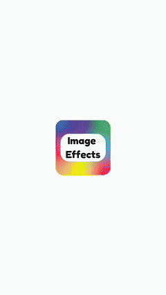

# Image Effects

## Introduction
A modern, mobile-first PWA to apply visual filters to photos directly in the browser using the Canvas API. Built with Bootstrap 5, vanilla JS, and a Service Worker for offline support.

## Description
Image Effects lets users quickly upload an image, preview it, apply preset visual effects (blur, sepia, brightness, contrast, black & white, hue rotate, invert, opacity, saturate), and download the result as a PNG with a timestamped filename. The UI is optimized for small screens with a bottom action bar and an effects bottom sheet, avoiding horizontal scrolling and ensuring a smooth, professional experience.

- Tech stack: HTML5 Canvas, Bootstrap 5, ES5/vanilla JS, Service Worker, Web App Manifest
- PWA features: offline-ready, installable (browser-managed prompt), proper icons/manifest
- UX highlights: mobile-first layout, accessible controls, disabled states until image load, reset focus handling

# Getting Started
1. Serve the `modern-ui/` folder over HTTP/HTTPS (do not open via `file://`).
2. Open `modern-ui/index.html` in a modern browser (Chrome, Edge, Safari, Firefox).
3. Upload an image, open the effects sheet, apply filters, and download the result.

- Icons are referenced from `icon/`.
- Service worker and manifest are already configured in `modern-ui/`.

## Userflow

<table>
  <tr>
    <td></td>
  </tr>
</table>

